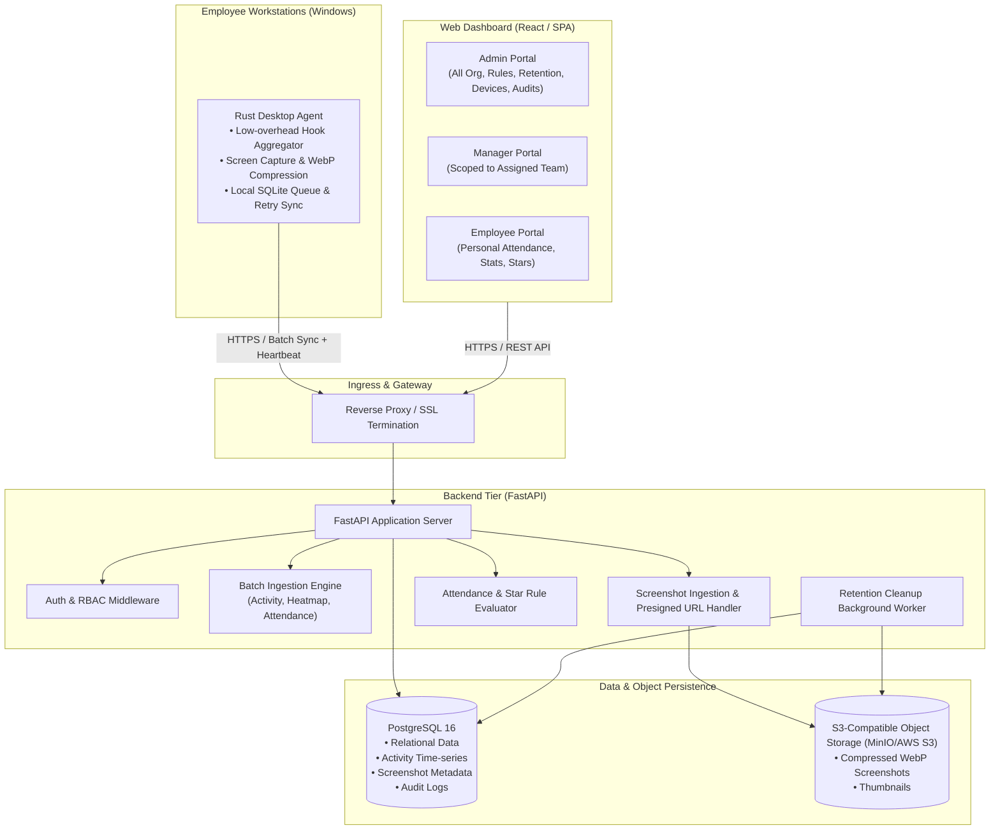
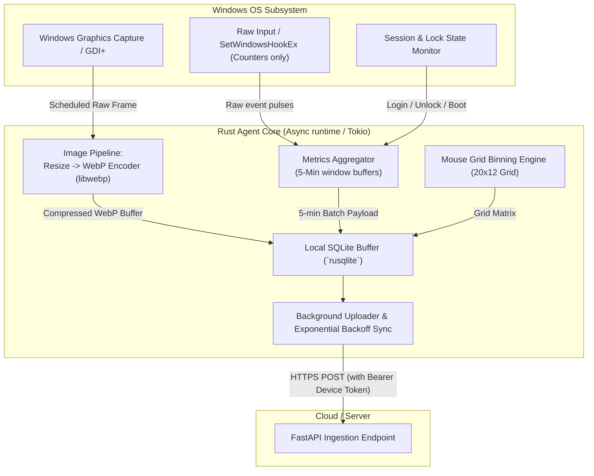
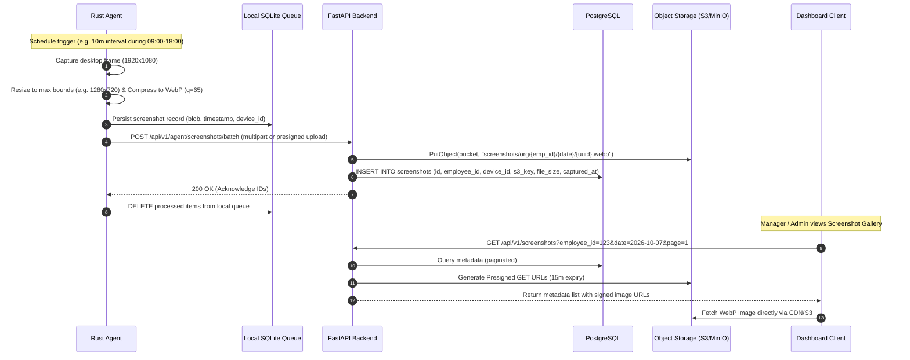
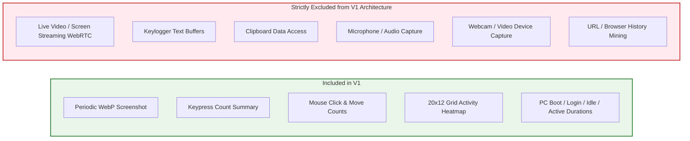
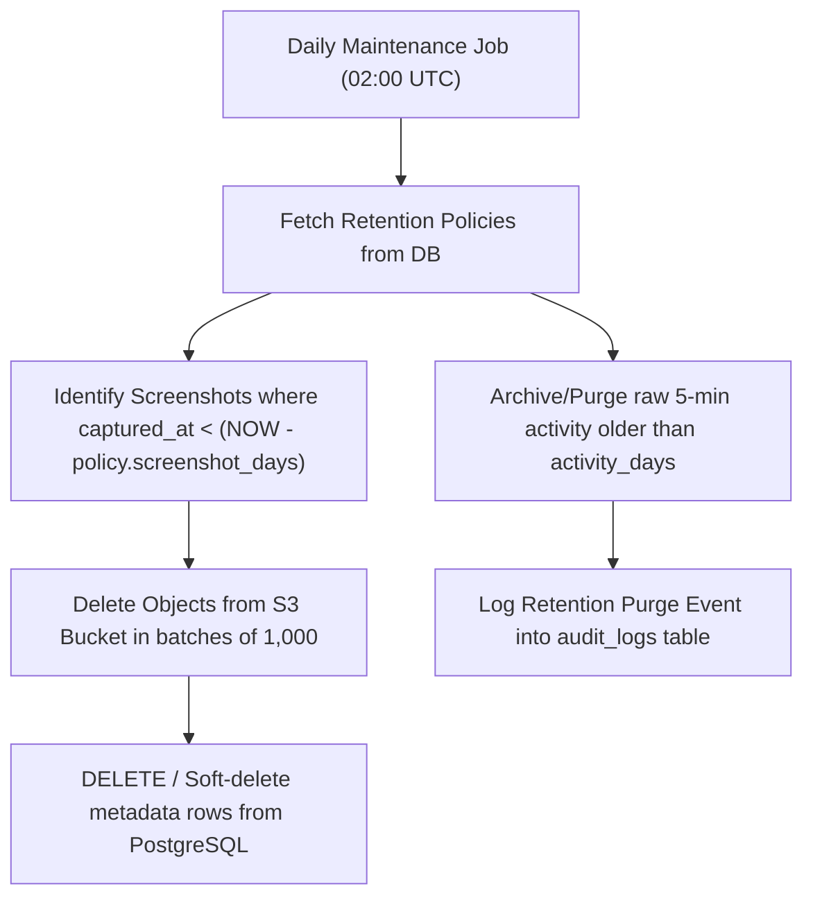

# System Architecture — Employee Tracking Platform

## 1. High-Level Architecture

---

## 2. Component Breakdown & Technology Stack

| Layer | Technology | Rationale & Responsibility |
|---|---|---|
| **Desktop Agent** | **Rust (`windows-rs`, `image`, `rusqlite`, `reqwest`)** | Minimal CPU (<0.5%) and RAM (<35MB) footprint. Zero runtime dependency. Captures global OS input events as atomic counters only. Compresses screenshots to WebP locally. Offline-first SQLite persistence. |
| **Backend API** | **Python 3.12 + FastAPI + Pydantic v2 + SQLAlchemy (Asyncpg)** | High-concurrency async I/O for heartbeat/batch ingestion, auto-generated OpenAPI schemas, strict data validation, rapid maintenance. |
| **Relational Database** | **PostgreSQL 16** | Robust relational model for multi-tenant org hierarchy, indexed time-range queries for attendance/activity intervals, JSONB support for configurable rule engine gaps. |
| **Object Storage** | **MinIO / AWS S3 / Cloudflare R2** | Decouples binary image storage from relational DB. Stores immutable WebP binaries, serves temporary presigned URLs for UI preview. |
| **Task & Retention Worker** | **FastAPI Background Tasks / Celery or APScheduler** | Daily attendance finalization, star calculation, automated eviction of expired screenshots per retention policy. |
| **Web Dashboard** | **Modern SPA (React + TypeScript + TailwindCSS / Vanilla CSS)** | Role-tailored dashboards (Admin, Manager, Employee) with responsive tables, heatmap renderer, and virtualized screenshot galleries. |

---

## 3. Desktop Agent Architecture (Rust)

### Agent Reliability & Safety Constraints
1. **Zero Raw Keystroke Capture**: Hooks increment atomic integers (`AtomicU64`) only. No scan codes or virtual keys are inspected or stored in memory.
2. **Offline-First Resilience**: If the network is unavailable, events and compressed images are stored in a local encrypted SQLite database (`agent_store.db`).
3. **Queue Limit & Backpressure**: Max local queue capped at 500MB / 7 days of data. Oldest un-synced screenshots are dropped if storage threshold is exceeded to protect the employee host.
4. **Non-blocking Compression**: Screenshot compression runs on a background thread pool to ensure input tracking and OS responsiveness are never hitched.

---

## 4. Screenshot Pipeline & Object Storage Flow

---

## 5. Subsystem Boundaries & Security Architecture

### 5.1 Authentication & Multi-Tier Scope Isolation
- **Device Authentication**: Agents authenticate via mutual pre-shared Device Registration Tokens exchanging for rotating JWT Device Keys (`DEVICE_AGENT` scope).
- **User Authentication**: Standard OAuth2 Password / Bearer JWT with roles: `ADMIN`, `MANAGER`, `EMPLOYEE`.
- **Manager Scope Gate**: An enforced database-level predicate / repository middleware restricts all manager queries:
  $$\text{Query Filter: } \text{employee.manager\_id} = \text{current\_user.id}$$

### 5.2 Explicit V1 Boundaries

---

## 6. Data Retention & Housekeeping Engine

---

## 7. Scaling & Performance Characteristics

1. **Agent Footprint**: <0.5% CPU during regular monitoring, <3% CPU brief spike during WebP encoding (0.2s duration), ~30MB Resident RAM.
2. **Bandwidth Economy**: WebP compression reduces typical 1080p full screenshots from ~4MB (PNG) to ~45KB–90KB (WebP q=60-70). A 10-minute interval across an 8-hour workday consumes < 4MB network upload per employee per day.
3. **Database Indexing**: Composite indexes on `(employee_id, captured_at DESC)` and `(employee_id, date DESC)` guarantee fast sub-50ms dashboard page loads.
