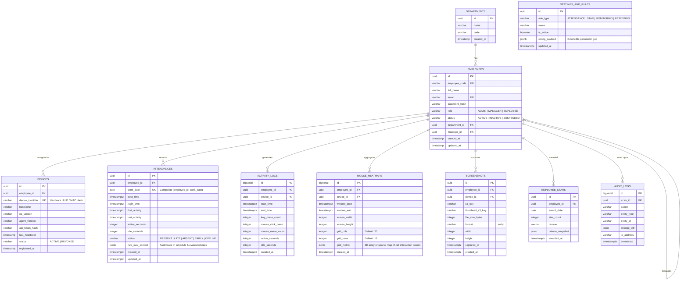
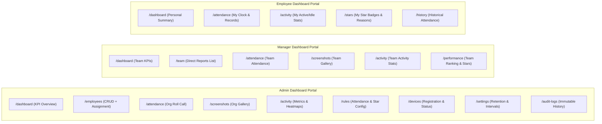
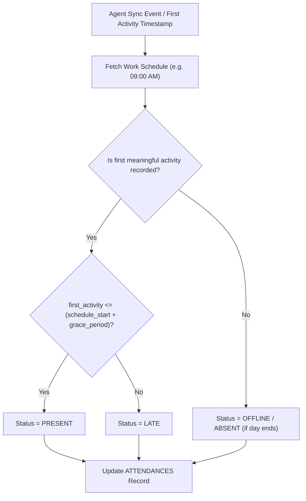

# System Design & Data Specifications — Employee Tracking Platform

## 1. Database Schema Design (PostgreSQL)



---

## 2. API Contract Specifications

### 2.1 Authentication & Profile
- `POST /api/v1/auth/login`
  - **Body**: `{ "email": "admin@org.com", "password": "..." }`
  - **Response (200)**: `{ "access_token": "...", "token_type": "bearer", "user": { "id": "...", "role": "ADMIN", "name": "..." } }`
- `POST /api/v1/auth/logout`
- `GET /api/v1/auth/me`

---

### 2.2 Agent Ingestion Endpoints (Device Authenticated)
- `POST /api/v1/agent/heartbeat`
  - **Headers**: `X-Device-Token: <token>`
  - **Body**: `{ "device_id": "...", "agent_version": "1.0.0", "timestamp": "2026-10-07T09:00:00Z" }`
  - **Response (200)**: `{ "status": "ok", "sync_interval_seconds": 300, "monitoring_active": true }`

- `POST /api/v1/agent/sync/batch`
  - **Headers**: `X-Device-Token: <token>`
  - **Body**:
    ```json
    {
      "employee_id": "3fa85f64-5717-4562-b3fc-2c963f66afa6",
      "device_id": "7fa85f64-5717-4562-b3fc-2c963f66afa7",
      "system_events": [
        { "event_type": "BOOT", "timestamp": "2026-10-07T08:30:00Z" },
        { "event_type": "LOGIN", "timestamp": "2026-10-07T08:50:00Z" }
      ],
      "activity_batches": [
        {
          "start_time": "2026-10-07T09:00:00Z",
          "end_time": "2026-10-07T09:05:00Z",
          "key_press_count": 428,
          "mouse_click_count": 71,
          "mouse_move_count": 1942,
          "active_seconds": 271,
          "idle_seconds": 29
        }
      ],
      "heatmap_batches": [
        {
          "window_start": "2026-10-07T09:00:00Z",
          "window_end": "2026-10-07T09:05:00Z",
          "screen_width": 1920,
          "screen_height": 1080,
          "grid_cols": 20,
          "grid_rows": 12,
          "grid_matrix": { "0,0": 14, "0,1": 8, "5,8": 32 }
        }
      ]
    }
    ```
  - **Response (200)**: `{ "processed_batches": 1, "acknowledged_until": "2026-10-07T09:05:00Z" }`

- `POST /api/v1/agent/screenshots/upload`
  - **Payload**: `multipart/form-data` with fields: `metadata` (JSON), `file` (WebP binary stream).
  - **Response (201)**: `{ "screenshot_id": "...", "uploaded_at": "2026-10-07T09:10:00Z" }`

---

### 2.3 Dashboard APIs (Admin / Manager / Employee)
- `GET /api/v1/dashboard/metrics`
  - Returns counts: `total_employees`, `present`, `late`, `absent`, `offline`, `avg_attendance_pct`, `total_stars`.
- `GET /api/v1/attendance`
  - **Query**: `?date_from=2026-10-01&date_to=2026-10-07&department_id=&employee_id=&page=1&limit=25`
- `GET /api/v1/activity/statistics`
  - Returns hourly/daily aggregated active/idle times, keypress & mouse totals.
- `GET /api/v1/activity/heatmap`
  - Returns composite heatmap matrix for a chosen employee and time window.
- `GET /api/v1/screenshots`
  - **Query**: `?employee_id=...&date=2026-10-07&page=1&limit=24`
  - **Response (200)**:
    ```json
    {
      "items": [
        {
          "id": "uuid",
          "employee_name": "Jane Doe",
          "captured_at": "2026-10-07T09:10:15Z",
          "thumbnail_url": "https://s3.example.com/presigned-thumb-url?...",
          "full_url": "https://s3.example.com/presigned-full-url?...",
          "device_hostname": "DESKTOP-JDOE"
        }
      ],
      "total": 48,
      "page": 1,
      "total_pages": 2
    }
    ```
- `GET /api/v1/rules` & `PUT /api/v1/rules/:id`
  - Reads & configures working schedules, attendance grace periods, star criteria, and retention limits.

---

## 3. UI/UX & Dashboard Page Structure



### 3.1 Screenshot Gallery Component
- **Grid Layout**: Responsive grid (3 to 6 cards per row).
- **Lazy Loading**: Virtualized scroll or 24-item pagination.
- **Lightbox / Modal**: Clicking any card opens full-resolution WebP modal with timestamp, employee details, and previous/next navigation buttons.
- **Filters**: Employee picker (for Admin/Manager), date range, time-of-day slider, device selector.

### 3.2 Mouse Heatmap Canvas Component
- **20x12 Visual Grid**: Rendered on HTML5 Canvas over a neutral screen mockup template.
- **Density Gradient**: Normalized from low frequency (blue/green) to high frequency (yellow/red).
- **Time Window Filter**: Ability to scrub between 5-min intervals or view a whole-day aggregated density map.

---

## 4. Attendance & Star Rule Engines

### 4.1 Attendance Determination Logic



### 4.2 Extensible Rules Configuration Schema (JSONB gap)
The database stores rule configurations in JSONB format, allowing admin-customizable parameters without schema migrations:

```json
{
  "attendance_rules": {
    "shift_start": "09:00:00",
    "shift_end": "18:00:00",
    "grace_period_minutes": 10,
    "minimum_active_hours_for_full_day": 7.0,
    "half_day_threshold_hours": 4.0
  },
  "star_rules": {
    "punctuality_star": {
      "enabled": true,
      "condition": "status == 'PRESENT' and first_activity <= '09:00:00'"
    },
    "activity_star": {
      "enabled": true,
      "condition": "active_seconds >= 25200"
    }
  },
  "monitoring_rules": {
    "working_days": ["MON", "TUE", "WED", "THU", "FRI"],
    "screenshot_interval_minutes": 10,
    "monitoring_window_start": "09:00:00",
    "monitoring_window_end": "18:00:00",
    "compression_quality": 65,
    "max_dimension": [1280, 720]
  },
  "retention_rules": {
    "screenshot_retention_days": 30,
    "activity_retention_days": 90,
    "attendance_retention_days": 730
  }
}
```
